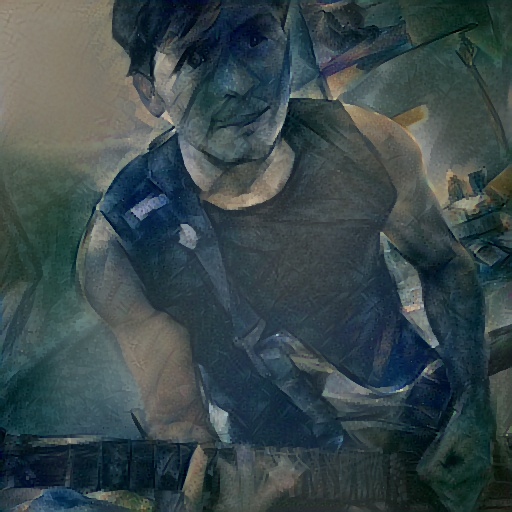
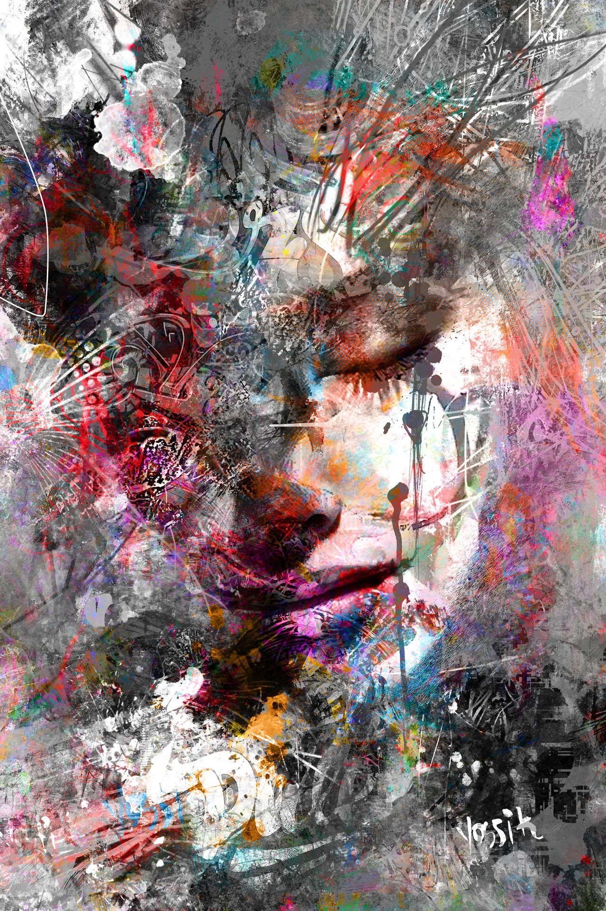
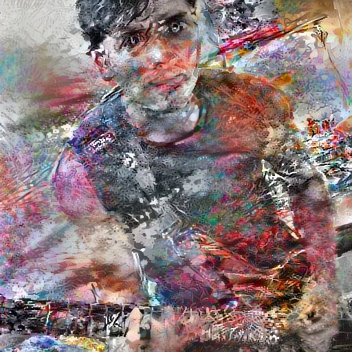
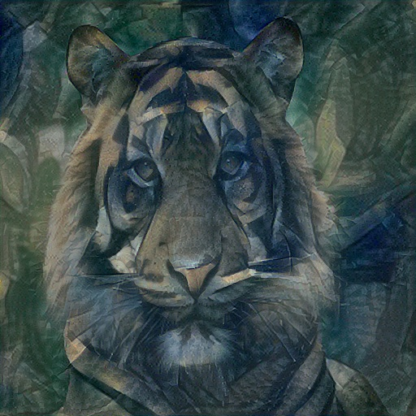
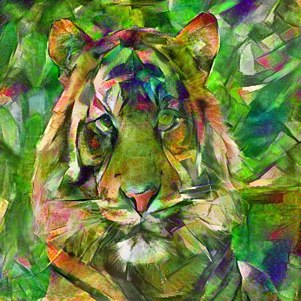

# Neural-Style-Transfer

Neural Style Transfer was presented in the paper A Neural Algorithm of Artistic Style by Gats, L., Ecker, A., and Bethge, M. (https://arxiv.org/abs/1508.06576).

In the notebook `Neural-Style-Transfer.ipynb` I present  my implementation of the algorithm, as well as the color transfer method presented in Presented Color in Neural Artistic Style Tranfer, by Gatys et al. (https://arxiv.org/abs/1606.05897)

Below I present some of the results of the algorithm.

   
 

 
